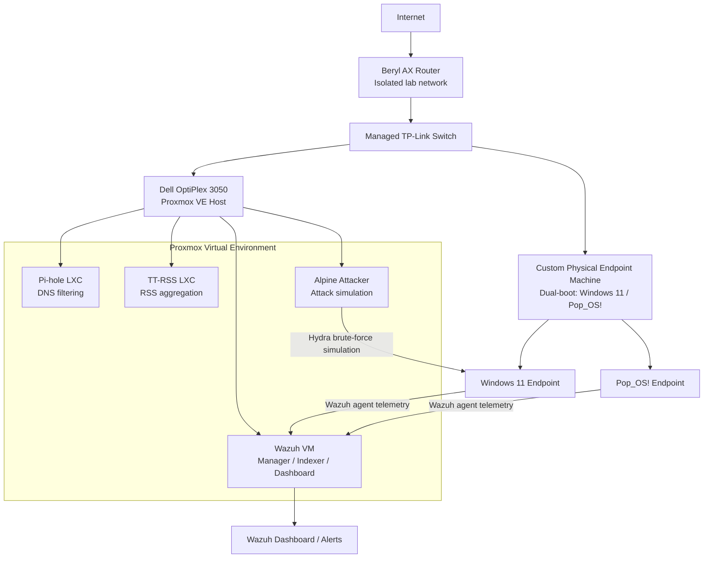

# Wazuh SOC Homelab

## Project Summary

Built and deployed a Wazuh-based SOC homelab in Proxmox to monitor endpoint and infrastructure security events. This project demonstrates SIEM deployment, endpoint onboarding, troubleshooting, log analysis, and alert validation through a simulated brute-force attack.

## Objective

The goal of this lab was to deploy a functioning Wazuh environment, connect Linux and Windows endpoints, and verify end-to-end alert generation during a realistic attack simulation. I also used the project to strengthen troubleshooting skills in networking, containerization, storage management, and agent enrollment.

## Skills Demonstrated

- SIEM deployment and configuration
- Security monitoring and alert validation
- Endpoint agent installation and troubleshooting
- Docker and container-based service deployment
- Proxmox virtualization and VM/LXC management
- Linux networking and Netplan configuration
- Windows agent configuration and service troubleshooting
- Storage troubleshooting and LVM expansion
- Attack simulation using Hydra
- Technical documentation and root-cause analysis

## Environment Overview

### Core Components

| Component | Type | Purpose |
|---|---|---|
| Wazuh VM | Virtual Machine | Central SIEM for security monitoring and log analysis |
| Pi-hole LXC | Container | DNS-level ad and threat filtering |
| TT-RSS LXC | Container | RSS feed aggregation |
| Pop_OS! Agent | Physical Machine | Endpoint monitoring and event forwarding |
| Windows 11 Agent | Physical Machine | Endpoint monitoring and event forwarding |
| Alpine Attacker LXC | Container | Used to simulate brute-force activity |

## Architecture

## Deployment Summary

### Wazuh Deployment

- Deployed Wazuh on an Ubuntu 22.04 Proxmox VM instead of LXC after initial container-related deployment issues.
- Installed Docker, cloned the Wazuh Docker repository, and launched the Wazuh stack with Docker Compose.
- Verified that the manager, indexer, and dashboard services were healthy and operational.

### Key Platform Details

- OS: Ubuntu 22.04
- RAM: 10 GB
- Disk: 60 GB
- Wazuh version: 4.13.1

## Attack Simulation

To validate detection capabilities, I simulated an SSH brute-force attempt from an Alpine Linux LXC VM against a Pi-hole LXC. Repeated failed login attempts were collected by the Wazuh agent, forwarded to the Wazuh manager, and confirmed in the dashboard as brute-force alerts.

### Validation Goals

- Confirm endpoint telemetry was being forwarded correctly
- Confirm Wazuh ingestion and alerting were working end to end
- Confirm security events were visible in the dashboard with useful alert details

## Key Challenges and Fixes

| Challenge | Problem | Resolution | Outcome |
|---|---|---|---|
| LXC Static IP Networking | Container had an IP address but no internet connectivity due to missing default gateway | Updated Netplan configuration to include the default route and applied the changes | Restored network connectivity |
| Wazuh LXC Deployment Failure | Initial LXC deployment failed due to OCI rlimits and SSL certificate-related errors | Switched deployment strategy to a dedicated Proxmox VM | Wazuh stack deployed successfully |
| Resource Exhaustion | Root partition reached 100 percent usage and Docker consumed significant disk space | Pruned Docker artifacts, cleaned journal logs, and expanded LVM storage | Recovered approximately 25 GB of free space |
| Windows Agent Enrollment | Windows agent installed but did not appear in the Wazuh dashboard | Updated `ossec.conf` with the correct Wazuh manager IP and restarted the service | Agent successfully enrolled and appeared healthy |

## Results

### Final State

- Wazuh dashboard accessible and operational
- Wazuh manager and indexer verified healthy
- Linux and Windows agents successfully connected
- Brute-force activity detected and visible in the dashboard
- End-to-end security event monitoring validated

## Evidence

### Suggested Screenshot Order

1. Architecture or component overview
2. Wazuh services/containers healthy
3. Successful Windows or Linux agent enrollment
4. Hydra brute-force activity in terminal
5. Wazuh dashboard showing brute-force alerts
6. Wazuh document details for a specific alert

## Example Screenshots

### Wazuh Services Healthy

### Agent Successfully Enrolled

### Hydra Brute-Force Simulation

### Brute-Force Alert in Wazuh Dashboard

### Wazuh Alert Detail View

## Lessons Learned

- A failed deployment path can still add value by showing troubleshooting depth and decision-making.
- Resource planning matters when deploying security tooling in virtualized environments.
- Endpoint enrollment issues are often caused by small configuration mismatches, especially IP settings.
- Simulated attacks are useful for validating whether detection pipelines are working end to end.
- Clear documentation makes it easier to explain technical work to recruiters, interviewers, and peers.

## Tools and Technologies

- Proxmox
- Ubuntu 22.04
- Wazuh
- Docker
- Windows 11
- Pop_OS!
- Hydra
- Netplan
- LVM

## What This Project Proves

This project shows that I can deploy and troubleshoot security monitoring infrastructure, onboard endpoints, simulate malicious behavior, and validate detections in a SIEM environment. It also reflects practical problem-solving across Linux administration, networking, virtualization, and security operations workflows.
