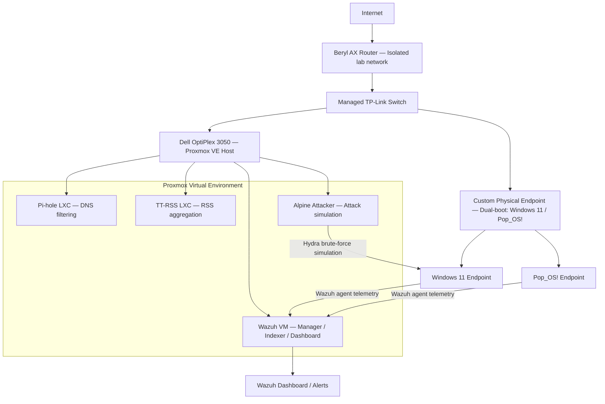

# Wazuh SOC Homelab

> **TL;DR for non-technical readers:** I built a fully functional security monitoring system from scratch at home — including virtual machines, real endpoints, network isolation, and a simulated cyberattack — to prove I can deploy, troubleshoot, and validate a SIEM environment end to end.

---

## Project Summary

Built and deployed a Wazuh-based SOC homelab in Proxmox to monitor endpoint and infrastructure security events. This project demonstrates real-world SIEM deployment, endpoint onboarding, hands-on troubleshooting across four distinct failure scenarios, and end-to-end alert validation through a simulated brute-force attack.

The troubleshooting experience was as valuable as the deployment itself — I hit real problems with LXC networking, OCI container limitations, disk exhaustion, and Windows agent enrollment, and resolved each one through root-cause analysis rather than starting over.

---

## Skills Demonstrated

- SIEM deployment and configuration (Wazuh 4.13.1 via Docker)
- Security monitoring and end-to-end alert validation
- Endpoint agent installation and troubleshooting (Linux + Windows)
- Docker and container-based service orchestration
- Proxmox virtualization — VM and LXC management
- Linux networking, Netplan configuration, static IP routing
- LVM storage management and partition expansion
- Attack simulation using Hydra
- Root-cause analysis and technical documentation

---

## Environment Overview

### Component Overview

| Component | Type | Purpose |
|-----------|------|---------|
| Wazuh VM | Virtual Machine | Central SIEM — manager, indexer, and dashboard |
| Pi-hole LXC | Container | DNS-level ad and threat filtering |
| TT-RSS LXC | Container | RSS feed aggregation |
| Pop_OS! Agent | Physical Machine | Endpoint monitoring and event forwarding |
| Windows 11 Agent | Physical Machine | Endpoint monitoring and event forwarding |
| Alpine Attacker LXC | Container | Attack simulation (Hydra brute-force) |

### Architecture



---

## Deployment

### Wazuh VM Specs

| Setting | Value |
|---------|-------|
| OS | Ubuntu 22.04 |
| RAM | 10 GB |
| Disk | 60 GB |
| Wazuh version | 4.13.1 |

### Deployment Steps

**1. Install Docker**
```bash
apt update && apt install -y docker.io docker-compose
```

**2. Clone and launch the Wazuh Docker stack**
```bash
git clone https://github.com/wazuh/wazuh-docker.git
cd wazuh-docker
git checkout v4.13.1
docker-compose up -d
```

**3. Verify all containers are healthy**
```bash
docker-compose ps
```


Dashboard accessible at: `https://192.168.8.249`

---

## Deployment & Troubleshooting

These weren't hypothetical challenges — each one was a real blocker that required diagnosing the actual failure, not just retrying the same steps.

---

### Challenge 1: LXC Static IP — No Internet Connectivity

**Problem**
- LXC container had an IP (`192.168.8.249`) but zero internet connectivity
- `ip route` showed no default gateway — Netplan config was incomplete

**Root Cause**
Proxmox LXC networking doesn't automatically inherit a default route. The Netplan YAML needed an explicit `routes` block pointing to the gateway.

**Fix** — see [`configs/netplan.yaml`](configs/netplan.yaml)

```yaml
network:
  version: 2
  ethernets:
    ens18:
      addresses:
        - "192.168.8.249/24"
      nameservers:
        addresses:
          - 192.168.8.10
          - 8.8.8.8
        search: []
      routes:
        - to: "default"
          via: "192.168.8.1"
```

```bash
netplan apply
reboot
```

**Result:** ✅ Full network connectivity restored

---

### Challenge 2: Wazuh LXC Deployment Failure (OCI rlimits + SSL EISDIR)

**Problem**
- Initial deployment to a Proxmox LXC failed with OCI rlimit errors and an SSL `EISDIR` error during certificate generation
- The LXC kernel namespace restrictions prevented Docker from running correctly inside the container

**Root Cause**
Proxmox LXC containers share the host kernel and have restricted namespace and rlimit capabilities. Wazuh's Docker stack requires privileges that LXC's unprivileged mode doesn't support cleanly.

**Fix**
Abandoned the LXC approach entirely. Deployed a dedicated Ubuntu 22.04 VM instead — full kernel access, no rlimit restrictions.

**Result:** ✅ Wazuh stack deployed successfully on first attempt on the VM

> **Lesson:** LXC is great for lightweight services. For anything that runs Docker with privileged operations, use a full VM. Don't fight the environment — recognize when to change your strategy.

---

### Challenge 3: Root Partition at 100% — Docker Disk Exhaustion

**Problem**
- Root partition `/` hit 100% capacity mid-deployment
- `df -h` showed `/var/lib/docker` consuming ~16 GB
- Docker operations were failing silently

**Root Cause**
Pulled multiple image versions during troubleshooting without pruning. Docker cached layers, stopped containers, and build artifacts accumulated unnoticed.

**Fix** — see [`scripts/cleanup.sh`](scripts/cleanup.sh)

```bash
# Step 1: Prune Docker artifacts
docker system prune -a

# Step 2: Reclaim journal logs
journalctl --vacuum-size=50M

# Step 3: Expand LVM storage
growpart /dev/sda 3
pvresize /dev/sda3
lvextend -l +100%FREE /dev/pve/data
resize2fs /dev/pve/data
```

**Result:** ✅ ~25 GB of free space recovered

> **Lesson:** Always size your VM disk conservatively for running services, but generously for anything running Docker. 40 GB wasn't enough; 60 GB was comfortable.

---

### Challenge 4: Windows Agent Enrollment — Error 1208 / Not Appearing in Dashboard

**Problem**
- Wazuh agent installed on Windows 11 successfully
- Agent was not appearing in the Wazuh dashboard — no connection established
- Windows Event Viewer showed Error 1208 — service failed to connect

**Root Cause**
`ossec.conf` on the Windows agent still had the default placeholder IP (`0.0.0.0`) for the Wazuh manager address. The agent had nothing valid to connect to.

**Fix** — see [`configs/ossec-agent.conf`](configs/ossec-agent.conf)

Edit `C:\Program Files (x86)\ossec-agent\ossec.conf`:

```xml
<ossec_config>
  <client>
    <server>
      <address>192.168.8.249</address>  <!-- Your Wazuh manager IP -->
      <port>1514</port>
      <protocol>tcp</protocol>
    </server>
  </client>
</ossec_config>
```

Then restart the service:
```powershell
net stop wazuh
net start wazuh
```

Or via Services panel: `services.msc` → Wazuh → Restart

**Result:** ✅ Agent appeared in dashboard with green status immediately after restart


---

## Attack Simulation

### Simulation 1: SSH Brute-Force (Hydra)

To validate that the full detection pipeline was working — agent → manager → indexer → dashboard — I simulated an SSH brute-force attack from the Alpine Linux LXC against the Pi-hole LXC.

**Attack command (Alpine attacker):**
```bash
hydra -l root -P /root/passwords.txt ssh://192.168.8.10 -t 4 -f
```

**What I was validating:**
- Endpoint telemetry forwarding correctly from the Pi-hole LXC agent
- Wazuh manager ingesting and correlating the failed SSH events
- Dashboard displaying brute-force alerts with useful detail (source IP, rule ID, timestamp)

**Result:** ✅ Repeated failed logins triggered Wazuh rule 5710 — alerts visible in dashboard with full event detail


---

## Results

| Validation Goal | Status |
|----------------|--------|
| Wazuh dashboard accessible and operational | ✅ |
| Manager and indexer verified healthy | ✅ |
| Linux endpoint enrolled and reporting | ✅ |
| Windows endpoint enrolled and reporting | ✅ |
| Brute-force attack simulated | ✅ |
| Brute-force alerts confirmed in dashboard | ✅ |
| End-to-end detection pipeline validated | ✅ |

---

## Repository Structure

```
wazuh-soc-homelab/
├── README.md
├── configs/
│   ├── netplan.yaml          # Static IP config for LXC networking (Challenge 1)
│   └── ossec-agent.conf      # Windows agent config template (Challenge 4)
└── scripts/
    └── cleanup.sh            # Docker + LVM disk recovery script (Challenge 3)
```

---

## Tools and Technologies

`Proxmox VE` · `Ubuntu 22.04` · `Wazuh 4.13.1` · `Docker` · `Docker Compose` · `Windows 11` · `Pop_OS!` · `Alpine Linux` · `Hydra` · `Netplan` · `LVM` · `Pi-hole`

---

## Lessons Learned

- A failed deployment path has as much value as a successful one — what matters is the diagnosis.
- Resource planning for Docker environments needs to be generous. Storage exhaustion is silent until it isn't.
- Endpoint enrollment failures almost always come down to a single misconfigured value. Read the config file before reinstalling the agent.
- Simulated attacks are essential for validating that your detection pipeline is actually working — not just that services are running.
- Switching strategies (LXC → VM) early, once you understand the root cause, is faster than fighting the environment.
